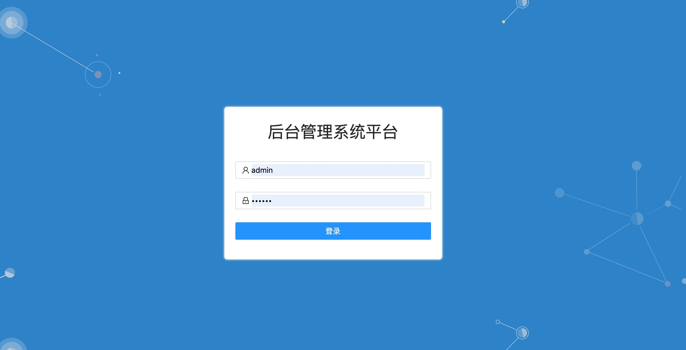
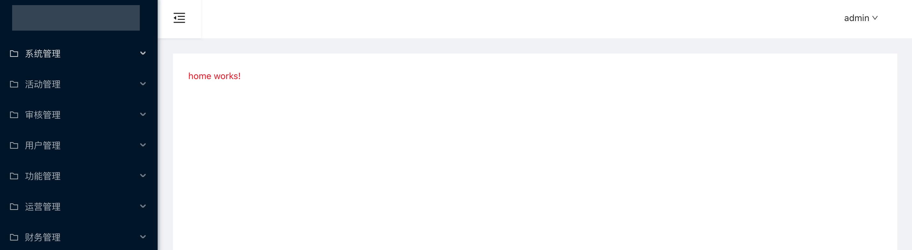

## 基础的使用

- 1、下载代码

  ```shell
  git clone https://github.com/kuangshp/angular-admin-web.git
  ```

- 2、安装依赖包

  ```shell
  npm install
  ```

- 3、运行命令

  ```shell
  npm run start
  ```

* 4、项目的中的接口对接的后端[项目地址](https://github.com/kuangshp/nestjs-mysql-api)
* 5、登录界面
  

* 6、里面界面
  
